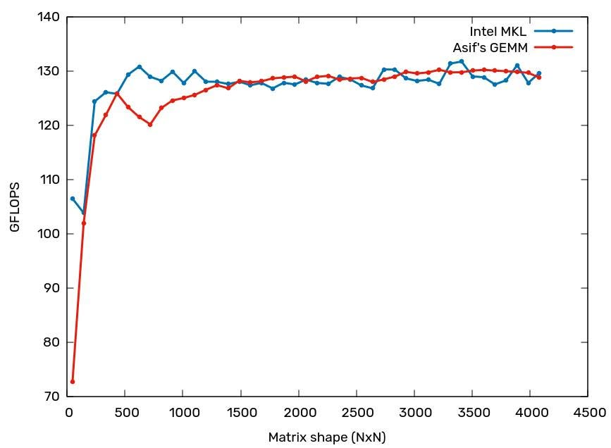

# matmul-learning

A small learning project focused on implementing a fast FP32 GEMM for x86_64 CPUs.

The implementation uses cache blocking, matrix packing, register blocking, SIMD kernels, and OpenMP. I experimented with AVX2 and AVX-512 builds while tuning the kernel for Intel CPUs.

## Performance

The benchmark compares MyGEMM against Intel MKL SGEMM on square matrices.



On my Intel CPU, MyGEMM showed more stable single-core performance across the tested matrix sizes, with less variation than Intel MKL in the same setup.

These results are hardware- and configuration-dependent and should not be treated as a general benchmark of MyGEMM versus MKL.

## Build

The project uses GCC, OpenMP, and Intel MKL.

```bash
make
```

## Benchmark

```bash
./output/matmul <repetitions> <start_dim> <end_dim> <step>
```

For example:

```bash
./output/matmul 10 256 4096 256
```

The benchmark writes results to `data/perf/` for plotting.

## Notes

This project is primarily for learning and experimentation with GEMM optimization on CPUs. The main areas of interest are SIMD kernels, cache hierarchy, packing, blocking, and performance stability.

